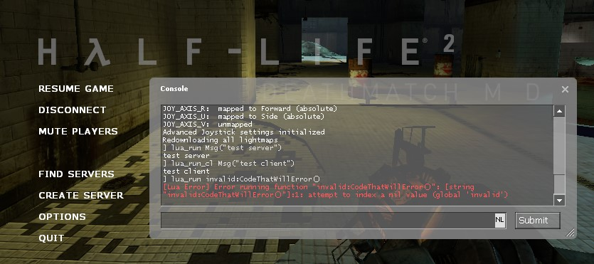

# Source SDK 2013 - Multiplayer with Lua

This template servers as a starting point for creating a multiplayer mod with the Source (1) SDK 2013. It embeds Lua 5.4 and provides a few examples on how to use it.



> [!NOTE]
> **Disclaimer:** This repository is not affiliated with, endorsed by, or in any way officially connected to Valve Software. Check out their [LICENSE](LICENSE) for more information on the usage of their content.

## 📦 Requirements

- Git *(for windows you can use [Git for Windows](https://git-scm.com/download/win))*

- Source SDK 2013 Multiplayer Base *(install this through Steam -> Library -> Tools)*

- [Visual Studio 2013](https://archive.org/details/en_visual_studio_community_2013_with_update_5_x86_dvd_6816332)

- *(Optional) You can use Visual Studio 2022 (or newer) if you like, but Visual Studio 2013 still has to be installed. Its build tools are used to compile the game projects. If you run into issues [check this Troubleshooting section](https://developer.valvesoftware.com/wiki/Source_SDK_2013#Troubleshooting).*

## 🚀 Getting started

> [!NOTE]
> The commands below will assume you are using Windows

1. [&raquo; See the Source SDK 2013 documentation for more information on setting up your development environment.](https://developer.valvesoftware.com/wiki/Source_SDK_2013)

2. Clone this repository to your `sourcemods` directory (wherever Steam is installed). While cloning, change the last argument to the name of your mod.

    ```bash
    cd "C:\Program Files (x86)\Steam\steamapps\sourcemods"
    git clone https://github.com/luttje/template-source-sdk-2013-lua mymodname
    ```

    *From here on out, replace `mymodname` with the name of your mod that you used in the command above.*

3. Open the `mymodname/src` directory and generate the game project files.

    ```bash
    cd mymodname\src
    creategameprojects.bat
    ```
  
    *This will generate the Visual Studio solution file `games.sln` and `.vcxproj` files for the game projects.*

4. Open the `games.sln` solution file in Visual Studio.

5. Change the solution configuration to `Release`.

6. Go to the `Build` menu and select `Build Solution`. Wait for the build to finish.

    In Visual Studio, check the `Output` window for any errors. If successful, you should see a message like:

    ```bash
    ========== Build: 6 succeeded, 0 failed, 0 up-to-date, 0 skipped ==========
    ```

7. Open `game/mod_hl2mp/gameinfo.txt` and change the `game` value from `My First HL2MP Mod` to the nice name of your mod, e.g: `My Awesome Mod`.

8. Restart Steam for the mod to show up in your library. You'll recognize it by the name you set in the `gameinfo.txt`.

9. Launch your mod.

10. In the main menu open `Options` and enable the Developer Console under `Keyboard` -> `Advanced` -> `Enable Developer Console`.

11. Now in the main menu go to `Create Server` and host a game, picking the only map available.

12. When in-game press the `~` key to open the console and:

    1. Type `lua_run Msg("Hello, Server!")`. The `lua_run` command is run on the server.

    2. Type `lua_run_cl Msg("Hello, Client!")`. The `lua_run_cl` command is run on the client.

    3. Both commands should print the provided message in the console.

    4. You can find these commands defined at the bottom of [src/game/shared/luahandle.cpp](src/game/shared/luahandle.cpp).

## 📚 Tips & Tricks

<details>

<summary>📃 How to add more scripts</summary>

You might expect that creating a `.h` and/or `.cpp` file in a folder, should have it show up in the project. However, this is not the case.

The `.vpc` scripts in each project directory are used to generate the project files. They are run when you execute the `creategameprojects.bat` (or similar) scripts.

Here's an example on how to add two new source files to the `Client` project:

1. Say that you have created two files:

    - `src/game/shared/my_script.cpp`
    - `src/game/shared/my_script.h`

2. Open `src/game/client/client_base.vpc` in a text editor.

3. Find the `$Folder	"Source Files"` section.

4. Find a suitable location to add the new files. It might be wise to put them well at the bottom (e.g: before the `$Folder	"Lua"` line).

5. Add the following lines and save the file:

    ```vpc
    $File	"$SRCDIR\game\shared\my_script.cpp"
    $File	"$SRCDIR\game\shared\my_script.h"
    ```

6. Ensure Visual Studio is closed.

7. Run `creategameprojects.bat` again.

8. Open the `games.sln` solution file in Visual Studio again.

You should now see the new files in the `Client` project, under the `Source Files` folder.

> **Tip:**
> Check out the `$Folder "Lua"` example in `src/game/client/client_base.vpc` to see how you can organize your files in folders.

</details>

<details>

<summary>🔗 How to add external libraries (.dll)</summary>

Check out [this commit `8043889`](https://github.com/luttje/template-source-sdk-2013-lua/commit/80438893a0acfb923707d13d3ee8a99760bcfb57) to see how Lua was implemented in this template.

Some important steps:

1. Add the `.dll` file to the `game/mod_hl2mp/bin` directory. This must be distributed with your mod.

2. Place `.lib` files in the `src/lib/public` directory.

3. Place any header files (`.h`) in the `src/public/lib` directory.

    *You may also place these in a subdirectory, e.g: `src/public/lib/lua`, in which case you will later include them like `#include "lua/lua.h"`.*

4. Ensure the `.lib` files are included in the `game` project's `.vpc` file, for Windows (32-bit) you would:

    1. Open `src/vpc_scripts/source_dll_win32_base.vpc` in a text editor.

    2. Find the `$Folder	"Link Libraries"` section at the bottom.

    3. Add the following line:

        ```vpc
        $Lib	"$LIBPUBLIC\lua54"
        ```

        *Replace `lua54` with the name of the library you are adding, do not include the `.lib` extension.*

5. Include the library headers where needed in your code.

    ```cpp
    #include "lua.h"
    // Or if you placed the headers in a subdirectory named 'lua':
    // #include "lua/lua.h"
    ```

6. Use the library in your code.

</details>

<details>

<summary>⌨ How to add new Lua functions</summary>

Check out [`luaMsg` in `src/game/shared/luahandle.cpp`](src/game/shared/luahandle.cpp) for an example on how to add new Lua functions.

Important steps:

1. Add a new function to `LuaHandle::RegisterFunctions`:

    ```cpp
    void LuaHandle::RegisterFunctions() {
        REG_FUNCTION(Msg);
        REG_FUNCTION(MyNewFunction); // Add this line
    }
    ```

2. Add the actual function definition to the file:

    ```cpp
    // Note that the function name is prefixed with 'lua' here
    int luaMyNewFunction(lua_State *L) {
        // Your code here
        return 0;
    }
    ```

</details>

## 📝 Useful sources

**Valve Developer Wiki:**

  - [Source SDK 2013 Documentation](https://developer.valvesoftware.com/wiki/Source_SDK_2013)
  - [Adding Lua](https://developer.valvesoftware.com/wiki/Adding_Lua)
  - [Implementing Discord RPC](https://developer.valvesoftware.com/wiki/Implementing_Discord_RPC)

**Half Life 2: Sandbox:**

*Note that the `hl2sb-src repo` wont compile out of the box, since it contains some merge errors and isn't actively maintained. However, it can be a good source of inspiration.*

  - [Half Life 2: Sandbox Source Code](https://github.com/Planimeter/hl2sb-src)
  - Implementing `hook.Call`:
    - [Macro in C](https://github.com/Planimeter/hl2sb-src/blob/2f1ca070339ce32caa4461bf3bd237ac013993cb/src/game/shared/luamanager.h#L56)
    - [Lua definitions](https://github.com/Planimeter/hl2sb-src/blob/2f1ca070339ce32caa4461bf3bd237ac013993cb/src/sourcelua/lua/includes/modules/hook.lua#L34)